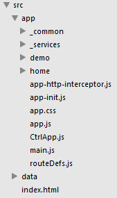

yt-代码组织结构说明
--------------------

该文档详细说明了代码的组织结构及如何去维护、扩展代码组织。  

目录

- 源码说明（细分） 
- node_modules说明
- vendor说明
- build说明
- 为什么要这样组织代码？

## 源码说明
首先说明一点，源码是不能直接运行的，必须经过build（详见build.md）流程。

看下  

src下有app、data两个文件夹及index.html。

- index.html webapp仅有的入口页面（SPA仅有一个页面，路由由前端控制）
- app 基于angularjs的代码
- data 模拟的json数据

在说app结构前，首先说明下命名规则

- `_` 开头的目录为多个功能或者页面共用的代码的存储目录
- `.tpl.html` 结尾的文件为[angular模板文件](https://docs.angularjs.org/guide/templates)
- `Ctrl` 开头的文件为[angular控制器](https://docs.angularjs.org/guide/controller)
- `Service` 开头的文件为[angular服务](https://docs.angularjs.org/guide/services)
- `.spec.js` 结尾的文件为单元测试文件

app结构

- _common 共用的，不适合放到 _services、 _filters的都放里面，默认有footer、header
- _services 共用的[服务](https://docs.angularjs.org/guide/services)
- demo 名字为demo的功能模块
- home 名字为home的功能模块
- main.js 程序的入口js，里面初始化了angular
- app.js 创建angular module，并返回app引用
- app-init.js app全局的配置，如get、post头，拦截器等
- routeDefs.js 路由配置（关键）
- app-http-interceptor.js 统一的请求拦截器
- app.css 页面的样式，构建过程会把所有的css都合并到app.css中

功能模块结构，看demo

- CtrlDemo.js demo控制器
- ServiceDemo.js demo服务
- FilterDemo.js demo过滤器
- DirectiveDemo.js demo指令
- CtrlDemo.spec.js 测试代码
- demo.tpl.html demo模板
- demo.css demo模块css，最终会合并到app.css中

ps: 如果功能模块比较复杂，可以在模块下建立子文件夹，子文件夹结构跟上面类似

## node_modules
npm 依赖安装的文件夹，在此路径下运行的node程序均可获取里面的依赖。我们在运行gulp任务的时候可以引用node_modules文件夹下的所有模块。

## vendor
第三方代码，这里是完整的第三方依赖。种子工程引入了angular,ui-bootstrap,couch-patato,angular-loading-bar,angular-ui-router,bootstrap,es5-shim,jquery,requirejs。

## build
构建的目标目录

## 为什么要这样组织代码
对于代码结构来说，一般的情况下，我们都这样构建前端的代码：css,js,images文件夹，然后所有的js都放js文件夹，所有的css都放css文件夹。这对于小型的项目（少于5个页面）其实是没有问题的，简单、直观。  

但是对于一般的系统级别的项目，页面一般大于10，这样的话，经过实践，通常是一堆js扔在那，没法看。  

好，后来我们生性了，把js按照页面划分，嗯，清楚了不少，但又会发现css存在同样的文件，然后我们把css也按页面划分。这样js、css分别清楚了，但这个页面模块的整体失去了。所以我们的webapp采用按功能模块的划分，一个相关的模块js,css,tpl,spec都放在一起，非常的直观，再加上统一的命名规范，维护性得到大大的提升。 

至于第三方的代码，我们不希望跟我们的源码糅在一起，所以分了一个vendor文件夹处理。这个也方便用bower得工具引入其他的第三方包。