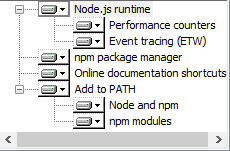

yt-种子工程说明
----------------
`必读` 该文档详细说明了如何从无到有开始搭建项目并配置相关环境。

目录：
- 如何安装NodeJS及npm
- 如何安装命令行工具yt-angular
- 如何使用yt命令初始化项目到指定文件夹
- 如何安装项目依赖
- 如何安装gulp
- 如何启动服务
- 如何配置bird-config
- 如何在浏览器查看

## 如何安装NodeJS及npm

- 登录 http://nodejs.org/ 并下载
- 安装的时候记得把npm package manager选中 
- check if ok. cmd -> `node -v` `npm -v`

## 如何安装命令行工具yt-angular

- 命令： npm install -g yt-angular
- 注意需要加 `-g` 参数，表明是在全局安装。这样在全局就拥有了yt命令行能力。

## 如何使用yt命令初始化项目到指定文件夹

- 进入你自己的workspace
- 命令： yt init family
- 这样会在workspace下创建一个文件夹family，里面有工程初始化需要的东西 
-  
- 
- src 源码
- vendor 第三方
- .bowerrc bower根配置
- bower.json bower配置
- package.json npm依赖
- gulpfile.js gulp配置
- bird-config.json bird服务配置

## 如何安装项目依赖

- cmd或者bash进到family目录
- 命令：npm install
- 这个命令会安装package.json里面定义的依赖 
- 安装完成之后会在family文件夹下，生成node_modules文件夹，里面有各个依赖的包
- 为什么要安装这些东西？这些依赖都是后续构建项目流程需要用到的。
- gulp [gulpjs流式构建系统](http://gulpjs.com/)
- gulp-bird [bird服务](https://github.com/chenchengxing/bird-v2)
- gulp-clean gulp清理插件
- gulp-jshint js代码检测插件
- gulp-livereload livereload插件
- gulp-replace replace插件
- jshint-stylish jshint报告插件
- merge-stream nodejs的stream合并插件

## 如何安装gulp
这是指的是全局安装gulp

- 命令：npm install -g gulp
- 这样就拥有的全局的gulp命令
- test if ok。 `gulp`

## 如何启动服务
服务是基于[bird](https://github.com/chenchengxing/bird-v2)的，bird服务会根据里面的配置启动相应的服务。

- 命令：gulp watch
- 这样就启动了gulpfile里面定义的
- 运行命令之后，可以看到在console里面输出`A server runing at port: 7676.`
- bird服务就成功启动了

## 如何配置bird-config
bird可以进行简单有效的配置，通过修改bird-config.json就可以做到。

- servers对象。servers可以有多个属性，每一个属性的key值为端口号。端口号下的basePath为需要启的服务指向的根路径。默认的根路径为{{yt init webapp}}/build,因为默认的构建流程会最终输出到build文件夹。
- transRules对象。该对象配置转发规则。先说明下何时转发，当在指定的server路径下没有找到指定的文件时，转发；当发送ajax请求时，转发。这个功能非常利于前后端分离模式下的调试。具体的参数，targetServer，可以配置目标的服务ip及端口。如测试机为http://cq01-iit-ci02.vm.baidu.com:8480/，你可以去ping cq01-iit-ci02.vm.baidu.com获取其ip，配置转发路径。regExpPath，这里配置特殊的转发规则，正则表达式书写，key为需要转发的路径，value的path为转发的目标。

## 如何在浏览器查看
根据服务起的端口，在浏览器端查看。默认配置是7676,即访问localhost:7676。